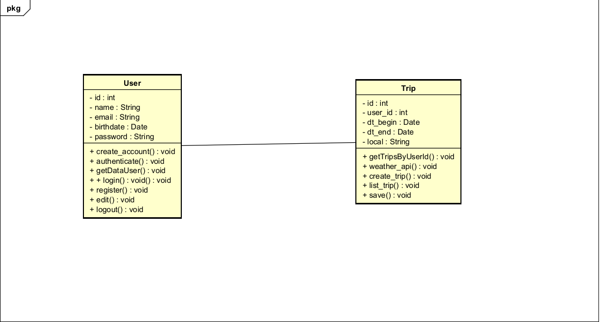

# Projeto: Planejamento de Viagens com Bottle e MySQL

Este projeto tem como objetivo auxiliar a escolha do usuário ao planejar suas viagens, permitindo com o preechimento a consulta do clima do local, com isso o usuarios poderá salvar essa viagem e posteriormente visualiza-las na listagem, o sistema ainda conta com o cadastro,edicao e autenticação dos usuarios do sistemas.

Desenvolvido com Python, microframework Bottle, HTML, CSS e JavaScript para o back-end este sistema é um projeto para a disciplina de Programação Orientada a Objetos (POO) da Universidade de Brasília (UnB).

## 💡 Funcionalidades

Cadastro, edição e autenticação de usuários

Planejamento de viagem com cidade e datas

Consulta da previsão do tempo via API

Autocomplete no campo em que vai ser preenchido o local de destino

Armazenamento persistente em banco de dados MySQL

Proteção de Rotas

---

## Diagram de Classes



---

## 🗂 Estrutura de Pastas

```bash
poo-python-bottle-template/
├── app.py # Ponto de entrada do sistema
├── config.py # Configurações e caminhos do projeto
├── main.py # Inicialização da aplicação
├── requirements.txt # Dependências do projeto
├── README.md # Este arquivo
├── controllers/ # Controladores e rotas
├── dump/ # Script do banco de dados
├── models/ # Definição das entidades (ex: User)
├── services/ # Lógica de persistência (JSON)
├── views/ # Arquivos HTML (Bottle Templating)
├── static/ # CSS, JS e imagens
├── data/ # Arquivos JSON de dados
└── .vscode/ # Configurações opcionais do VS Code
```

---

## 📁 Descrição das Pastas

### `controllers/`
Contém as classes responsáveis por lidar com as rotas da aplicação. Exemplos:
- `user_controller.py`: rotas para edição, adição logout dos usuários.
- `base_controller.py`: classe base com utilitários comuns.
- `trip_controller.py`: rotas para criação e listagem das viagens.

### `models/`
Define as classes que representam os dados da aplicação.
- `user.py`: classe `User`, com atributos `id`, `name`, `email`, `birthdate` e `password`
- `trip.py`: classe `Trip`, com atributos `id`, `user_id`, `dt_begin`, `dt_end` e `local` 

### `services/`
Responsável por salvar, carregar e manipular dados usando MySql.
- `user_service.py`: contém métodos `create_account`, `authenticate`, `getDataUser`, `update_user`.
- `trip_service.py`: contém métodos `save` e `getTripsByUserId`.
- `auth_service.py`: contém o método `authenticate`.


### `views/`
Contém os arquivos `.tpl` utilizados pelo Bottle como páginas HTML:
- `login.tpl`: tela de login.
- `register.tpl`: formulário de cadastro.
- `trip-create.tpl`: formulário para adicionar e consultar o clima da viagem.
- `trip-list.tpl`: listagem de viagens.
- `trip.tpl`: tela com menu de opcoes.
- `user-edit.tpl`: formulário para editar usuário.

### `static/`
Arquivos estáticos como:
- `css/login.css`: estilos para tela de login.
- `css/register.css`: estilos para tela de cadastro.
- `css/trip-create.css`: estilos para formulario de cadastro da viagem.
- `css/trip-list.css`: estilos para tela de listagem de viagens.
- `css/trip.css`: estilos para tela acesso ao realizar login com menu de opções.
- `css/user-edit.css`: estilos para tela de edição do usuario.
- `js/loadCities.js`: arquivo JavaScript que conecta com api que realiza autocomplete de cidades.
- `js/selectWeather.js`: arquivo JavaScript que realiza conexao com api de informações climaticas.

---

## ▶️ Como Executar

1. Crie o ambiente virtual na pasta fora do seu projeto:
```bash
python -m venv venv
source venv/bin/activate  # Linux/Mac
venv\\Scripts\\activate     # Windows
```

2. Entre dentro do seu projeto criado a partir do template e instale as dependências:
```bash
pip install -r requirements.txt
```

3. Define as variaveis do banco de dados e keys da api
```
Definir nos arquivos trip_service.py, user_service.py e config.py as variaveis de conexao com banco de dados.
Nos arquivo do projeto estao definidor as variaveis utilizando o MySqlWorkbench e o servidor que roda no DBngin

Definir nas url de conexao com api as keys de desenvolvimento caso as que estão definidas no sistemas deixem de funcionar
Para adquirir as keys é necessário criar uma conta nos sites:
1.openweathermap
2.geoapify
```

4. Rode a aplicação:
```bash
python main.py
```

5. Accese sua aplicação no navegador em: [http://localhost:8080](http://localhost:8080)

---

## 🧠 Autor e Licença
`Arthur Soares Parente`
`João Costa`
